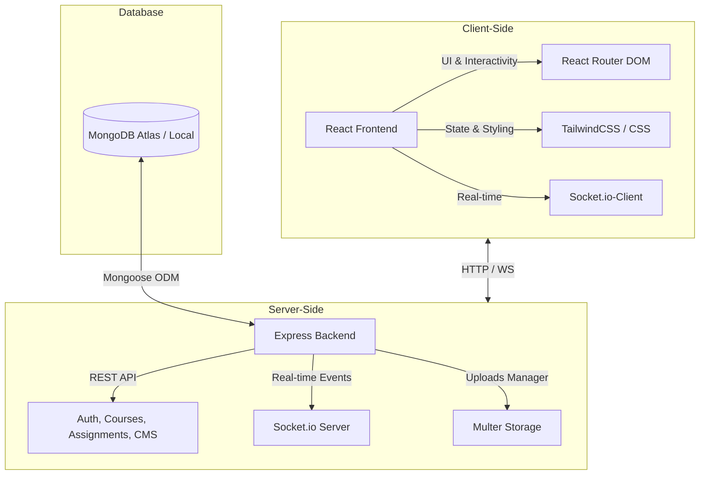

# 🏫 ISSAT Kasserine University Portal

An advanced, full-stack Academic & Administrative Web Portal for **ISSAT Kasserine (Institut Supérieur des Sciences Appliquées et de Technologie de Kasserine)**.

This portal is structured as a monorepo, separating the React-based Single Page Application (SPA) frontend from the robust Node.js/Express REST API backend.

---

## 🏗️ Architecture Overview



---

## 👥 Actors & User Roles

The portal supports four distinct actors, each with customized dashboards and functional flows:

| Role | Description | Key Permissions & Features |
| :--- | :--- | :--- |
| **👑 Admin** | Platform Administrator | Manage posts (news/events), CMS page configuration, upload galleries, user roles/status, reset passwords, and system statistics. |
| **👨‍🏫 Teacher** | Academic Instructor | Create courses, register student rosters, upload course assignments, log student attendances, grade submissions (/20), and send direct notifications to classes. |
| **🎓 Student** | Academic Student | Enroll in courses, view class schedules, check course materials, download assignments, submit work, view grades, track attendance, and read direct notifications. |
| **🌐 Visitor** | Unauthenticated User | Browse the public landing page, read news/notices/tenders, contact support, view the university gallery, and request course enrollment details. |

---

## 📂 Project Structure

```
university-portal/
├── backend/                  # Node.js + Express API Server
│   ├── src/
│   │   ├── config/           # DB & env configuration
│   │   ├── controllers/      # Route controllers (logic)
│   │   ├── middleware/       # JWT auth, uploads, errors
│   │   ├── models/           # Mongoose Schemas (User, Course, etc.)
│   │   ├── routes/           # REST API endpoints
│   │   ├── seeds/            # Data seed scripts
│   │   ├── socket.js         # Socket.io integration
│   │   └── server.js         # Express listener
│   └── package.json
│
├── frontend/                 # React Single Page Application (SPA)
│   ├── public/               # Static assets & index.html
│   ├── src/
│   │   ├── components/       # Shared UI components
│   │   ├── pages/            # Page layouts & router views
│   │   ├── services/         # API (Fetch) and socket connections
│   │   └── index.js          # App entry-point
│   └── package.json
│
└── package.json              # Monorepo root script runner
```

---

## 🚀 Getting Started

Follow these steps to run the portal locally on your development machine.

### 📋 Prerequisites
- **Node.js** (v16.x or higher recommended)
- **NPM** (v8.x or higher)
- **MongoDB** (local installation or MongoDB Atlas Cloud URI)

### 🔧 1. Clone & Set Up Environments
Clone the repository:
```bash
git clone https://github.com/mohamedaziznachet/University-Portal-Issat-Kasserine-.git
cd University-Portal-Issat-Kasserine-
```

Create a `.env` file in the `backend/` directory:
```bash
cp backend/.env.example backend/.env
```
Update your `backend/.env` with your Mongo URI:
```env
PORT=5000
MONGODB_URI=mongodb://127.0.0.1:27017/university-portal
JWT_SECRET=your_jwt_secret_key
CLIENT_URL=http://localhost:3000
```

### 📦 2. Install Dependencies
Run the root script to automatically install frontend and backend dependencies:
```bash
npm run install-all
```

### 🗄️ 3. Seed Demo Data
Populate the database with pre-configured mock data (classes, students, teachers, and posts):
```bash
npm run seed --prefix backend
```

### 💻 4. Run Locally
Start both the React client and Express API concurrently:
```bash
npm run dev
```
- Frontend will open on **`http://localhost:3000`**
- Backend will run on **`http://localhost:5000`**

---

## 🔑 Demo Accounts

Use the following seeded accounts to test different roles:

| Username (ID) | Password | Role |
| :--- | :--- | :--- |
| **`00000001`** | `Admin@123` | 👑 Admin |
| **`11111111`** | `Teacher@123` | 👨‍🏫 Teacher |
| **`22222225`** | `Student@123` | 🎓 Student |

---

## 🛠️ Main Tech Stack
- **Frontend**: React (v18), React Router (v6), TailwindCSS, Socket.io-client, Lucide React icons, Leaflet.
- **Backend**: Node.js, Express.js, MongoDB (Mongoose), Socket.io, JWT (JSON Web Tokens) authentication, Multer file uploader.
- **Monorepo Dev Runner**: Concurrently.
